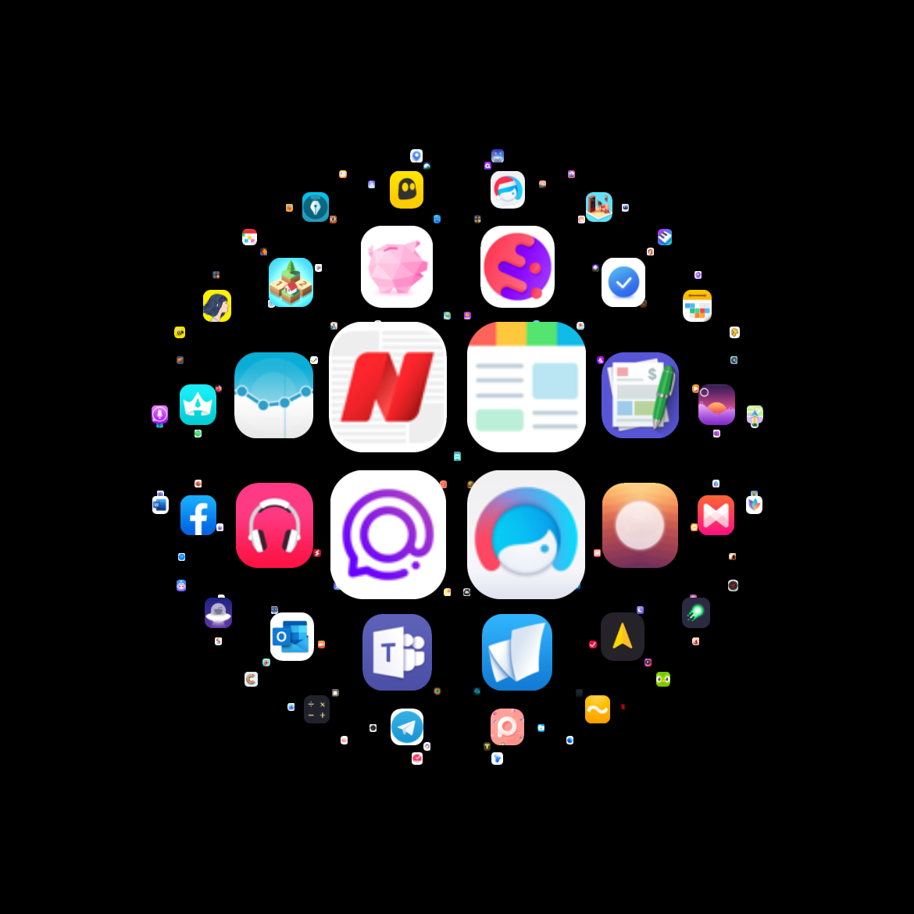

# React Native Animation Samples

Some very interesting and challenging animation samples built in react-native

## 🧬 Samples
| Project | |
| :--- | --- |
| **[> Expo Snack](https://snack.expo.dev/@ashu_dubey/react-native-animation-samples)**<br>**[> YouTube Tutorial Playlist](https://www.youtube.com/playlist?list=PLpnMM6hhRcchaS1uSpMZfAKYTxZWIlzzN)** |  |
| <h3>1. Custom Toolbar</h3>**[> YouTube Tutorial](https://youtu.be/27pTWrcEDC4)**<br><br>A Custom playful, interactive toolbar with cool gesture based interruptible animations.<br><br>**[> Browse](./src/samples/custom_toolbar#readme)**<br>**> Demo: [twitter](https://twitter.com/aashudubey_ad/status/1539354978266935296) \| youtube [short 1](https://youtube.com/shorts/i7xw93xqkRE), [short 2](https://youtube.com/shorts/QMt18WcWyGw)** | <a href="./src/samples/custom_toolbar#readme" title="Animated Toolbar"></a> |
| <h3>2. Color Swatch</h3>**[> YouTube Tutorial](https://youtu.be/lK6rAktDQJQ)**<br><br>A Color Swatch that plays a circular rotation based on user gestures.<br><br>**[> Browse](./src/samples/color_swatch#readme)**<br>**> Demo: [twitter](https://twitter.com/aashudubey_ad/status/1545139506457690112) \| [youtube](https://youtube.com/shorts/2dhPPNeOc1I)** | <a href="./src/samples/color_swatch#readme" title="Color Swatch"></a> |
| <h3>3. Grid Magnification</h3>A grid list view that displays Magnify effect on long press & drag, focusing on the items near the touch area within a radius.<br><br>**[> Browse](./src/samples/grid_magnification#readme)**<br>**> Demo: [twitter](https://twitter.com/aashudubey_ad/status/1553434985620656128)**<br>**> Alternatives: [Flutter](https://github.com/Aashu-Dubey/flutter-samples/tree/main/lib/samples/animations/grid_magnification)** | <a href="./src/samples/grid_magnification#readme" title="Grid Magnification"></a> |
| <h3>4. Rope Physics</h3>A realistic looking gesture controlled, bezier based Rope UI implementation and related samples.<br><br>**[> Browse](./src/samples/rope_physics#readme)**<br>**> Demo: [twitter](https://twitter.com/aashudubey_ad/status/1571250425772544000)** | <a href="./src/samples/rope_physics#readme" title="Rope Physics"></a> |

### 🧬 Other samples (Incomplete) 🚧

- [Cards Swap](https://github.com/Aashu-Dubey/react-native-animation-samples/tree/cards_swap/src/cards_swap):- A drag/swipe demo where the cards dodge each other with gesture based animations. [See preview](https://twitter.com/aashudubey_ad/status/1543701552820469760)

## 🖥 Running locally

```bash
# after clone, cd into the directory
# install dependencies
yarn install

# iOS only
npx pod-install ios
# or
cd ios && pod install && cd ..

# Run iOS
npx react-native run-ios

# Run Android
npx react-native run-android
```
