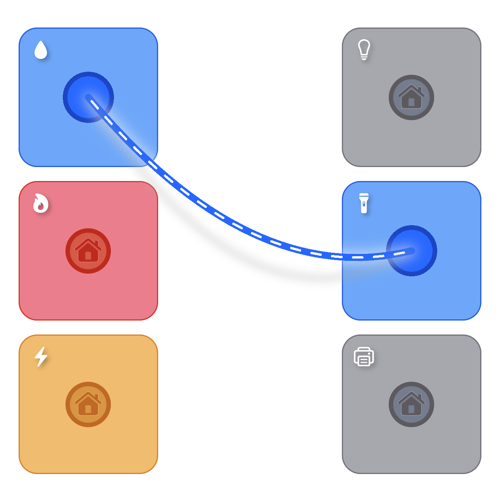

# Rope Physics

Some samples for gesture controlled, bezier based rope implementation.

There are 2 different solutions based on [react-native-skia](https://github.com/Shopify/react-native-skia) & [react-native-svg](https://github.com/react-native-svg/react-native-svg)

- [RopeViewSkia.tsx](./RopeViewSkia.tsx):- Interactive Rope implementation using react-native-skia.
- [RopeViewSvg.tsx](./RopeViewSvg.tsx):- Interactive Rope implementation using react-native-svg.
- [Connect the Socket](./plug_socket#readme):- A demo showcasing an interactive usage of Rope view layout in an application. based on this [demo](https://twitter.com/DLX/status/1544373383915356167).

## ✨ Some features

1. Two ends of the rope are controllable through gestures.
2. Skia sample has Glow and Shadow effect with the rope layout to give it a more realistic feel, through cannot find similar solution for SVG implementation cause of [no blur support](https://github.com/react-native-svg/react-native-svg/issues/150).
3. Can easily switch between Skia <---> SVG implementation, to use respective's rope view layout on a full-fledged sample.

## 📦 Packages used

1. [@shopify/react-native-skia](https://github.com/Shopify/react-native-skia):- Drawing and controlling the rope layout using Skia APIs.

2. [react-native-svg](https://github.com/react-native-svg/react-native-svg):- Rope layout UI using SVG APIs.

3. [react-native-gesture-handler](https://github.com/software-mansion/react-native-gesture-handler):- Track user gestures to control the rope's movement on the screen.

4. [react-native-reanimated](https://github.com/software-mansion/react-native-reanimated):- For ropes related animations. For skia it's only used for gesture based view movements, but for SVG all animations are controlled by reanimated.

5. [react-native-vector-icons](https://github.com/oblador/react-native-vector-icons):- Google Material icons, to use in [Connect the Socket](./plug_socket#readme) demo.

6. [react-native-sfsymbols](https://github.com/birkir/react-native-sfsymbols):- Apple's SF Symbols (iOS only), to use in [Connect the Socket](./plug_socket#readme) demo.

7. [react-native-safe-area-context](https://github.com/th3rdwave/react-native-safe-area-context):- Handle UI for iOS Safe Area.

## 🌻 Motivation

Inspired by [this original SwiftUI implementation](https://twitter.com/DLX/status/1544373383915356167) by [@robb](https://github.com/robb).

## 🔗 Reference

- [Blog Post](https://blog.maximeheckel.com/posts/the-physics-behind-spring-animations/) with detail explanation for physics behind spring animations.
- [This video](https://www.youtube.com/watch?v=yBuhnVDXekQ) by [@wcandillon](https://github.com/wcandillon) really helped me to get an idea about applying gesture interactions for individual Skia components.
